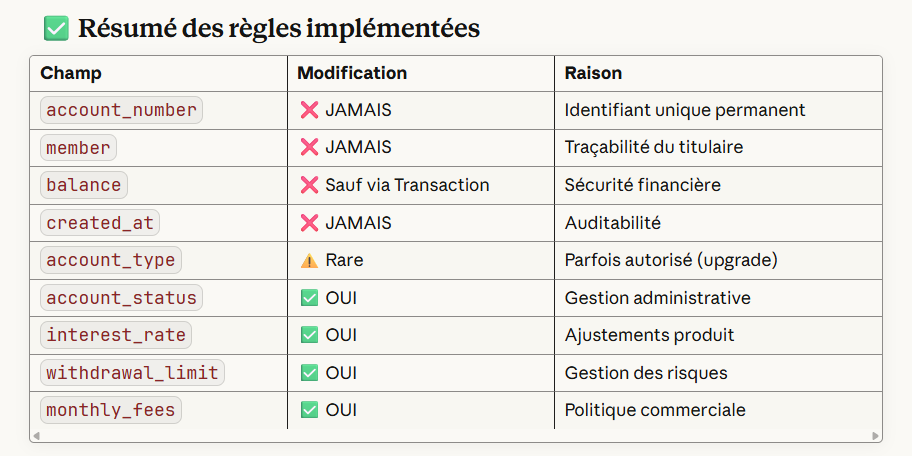

## Principes métier pour compte

Un membre peut avoir plusieurs comptes. Les règles d’accès/avantages d’un compte dépendent souvent du statut du membre (active/inactive), de son ancienneté, du total dépôts / solde courant et parfois du nombre de comptes.

Avant de créer un compte, on vérifie l'existence et l'état du membre (ex : actif/suspendu) et éventuellement s’il n’a pas de blocages (ex : interdiction, KYC non complété).

Les avantages (taux préférentiels, dispense de frais, limites de retrait, plafond d’encours, accès à produits) sont calculés selon des règles métier — p.ex. :

Ancienneté >= 24 mois → « senior » → meilleur taux, frais réduits.

Solde cumulé > X → prime ou taux bonus.

Nombre comptes > N → conditions favorisées.

Back-end : la validation finale et la logique sensible (ex : vérification KYC, blacklist, création d’un compte) doit être faite côté serveur. Frontend donne l’UX + vérifs préliminaires.
Concept clé : le folio
Dans une caisse populaire, chaque membre a un folio (numéro unique).

Tous ses comptes (courant, épargne) sont rattachés à ce folio.

Le folio est l’ID du membre.

Sous cet ID, tu rattaches une liste de comptes.

📋 Structure de données (simplifiée)
ts
// Un membre avec son folio
interface Member {
  folio: string; // identifiant unique du membre
  name: string;
  accounts: Account[];
}

// Un compte (courant, épargne, etc.)
interface Account {
  id: string; // identifiant unique du compte
  type: "courant" | "epargne" | "CELI" | "REER"; // type de compte
  balance: number; // solde
}
Exemple de données :

ts
const member: Member = {
  folio: "F12345",
  name: "Alma Mercier",
  accounts: [
    { id: "C001", type: "courant", balance: 1200 },
    { id: "C002", type: "epargne", balance: 5000 }
  ]
};

4️⃣ Les taux ne devraient jamais être calculés uniquement côté front

Actuellement :

tauxInteret = baseInterest + bonusInterest

👉 Dans une vraie caisse, les taux sont dynamiques, souvent tirés d’un service externe ou d’une table.

💡 Front : estimations
💡 Back-end : taux final officiel

5️⃣ Numéro de compte : la génération doit venir du back-end

Tu fais :

001-123456

→ C’est OK pour UX, mais danger en vrai :

collisions possibles

conventions internes (ex : check digit)

séries réservées par produit

auditabilité

💡 Recommandation :

Front : “prévisualisation”

Back-end : génère le vrai numéro
=========================
🔜 Ce qu’il faut améliorer pour être 100% bank-grade
🔐 Double validation backend

Ne jamais se fier uniquement au front :
→ Refaire toutes les validations côté serveur pour éviter des bypass.

🧮 Calculs sensibles côté serveur

Intérêts, soldes, avantages, pénalités…
→ Tous les calculs doivent être exécutés serveur-side pour être sécurisés et auditables.

📄 Folio mis en avant

Clarifier et standardiser le folio/ID de transaction partout :
→ En-têtes
→ Exports
→ Vue détaillée
→ Recherche / filtrage

🎁 Avantages dépendants du solde total

Les perks, bonus, statuts doivent dépendre du solde global d’un client (tous comptes confondus), pas compte par compte.

🔢 Numéro de compte généré côté serveur

Le front ne génère jamais un numéro sensible.
→ ID strictement générés par le backend (UUID, schema bancaire, séquences, etc.).

🔧 Règles dynamiques (taux, dépôts)

Les taux et limites ne doivent pas être codés en dur.
→ Ils doivent venir du backend (ou config)
→ Idéalement ajustables par admin
→ Versionnées pour traçabilité
